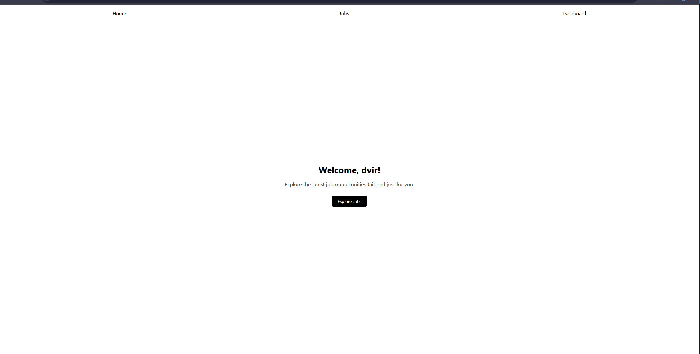

# Job Board 💼

### Live Demo

## About
This is a full-stack job board application where employers can post and manage jobs, and job seekers can browse and view job listings.

## Tech Stack
* **Frontend:** React (Vite) + TypeScript
* **Backend:** Node.js + Express
* **Database:** Prisma + PostgreSQL
* **Auth:** Session-based authentication

## Key Features
* **Employers:** Create, edit, and delete job postings with proper authorization.
* **Job Seekers:** Browse available jobs, view details, and save favorites.

## Screenshots
<table>
  <tr>
    <td><b>Job Listings</b></td>
    <td><b>Management Dashboard</b></td>
  </tr>
  <tr>
    <td></td>
    <td></td>
  </tr>
  <tr>
    <td colspan="2" align="center"><b>Favorite Jobs Page</b> 
    </td>
  </tr>
</table>
